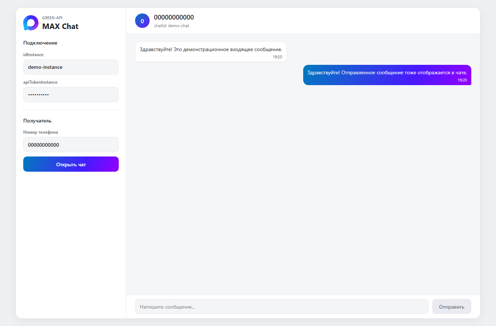

# GREEN-API MAX Chat

[](https://github.com/toshnotik/green-api-chat/actions/workflows/ci.yml)

Демонстрационное тестовое React-приложение для отправки и получения текстовых сообщений
в MAX через GREEN-API. Не является официальным клиентом MAX.

## Demo

[Live demo](https://toshnotik.github.io/green-api-chat/)



## Возможности

- подключение по `idInstance` и `apiTokenInstance`;
- открытие чата;
- отправка текстовых сообщений;
- получение входящих сообщений через HTTP API;
- отображение отправленных и полученных сообщений текущей сессии.

## Стек

- React
- TypeScript
- Vite
- SCSS Modules
- native Fetch API

## Запуск

```bash
npm install
npm run dev
```

Для работы нужны GREEN-API MAX instance, `idInstance` и `apiTokenInstance`.
Credentials вводятся непосредственно в интерфейсе приложения.

## Настройка GREEN-API

Для получения входящих сообщений через HTTP API в настройках instance:

- `incomingWebhook` должен быть включен;
- `webhookUrl` должен быть пустым.

После изменения настроек GREEN-API может потребоваться небольшое время до их применения.

## Как пользоваться

1. Введите `idInstance` и `apiTokenInstance`.
2. Введите номер MAX в цифровом международном формате: 11 цифр с кодом `7`
   (РФ) или 12 цифр с кодом `375` (РБ), без `+` и пробелов.
3. Нажмите `Открыть чат`.
4. Отправляйте и получайте текстовые сообщения.

## Используемые методы GREEN-API

- [CheckAccount](https://green-api.com/v3/docs/api/service/CheckAccount/)
- [SendMessage](https://green-api.com/v3/docs/api/sending/SendMessage/)
- [ReceiveNotification](https://green-api.com/v3/docs/api/receiving/technology-http-api/ReceiveNotification/)
- [DeleteNotification](https://green-api.com/v3/docs/api/receiving/technology-http-api/DeleteNotification/)

## Ограничения

Очередь уведомлений общая для всего instance GREEN-API. Пока чат открыт,
приложение последовательно получает уведомление, проверяет его и подтверждает
через `DeleteNotification`. В историю добавляются только поддерживаемые входящие
текстовые сообщения активного чата после успешного удаления уведомления.
Уведомления других чатов и неподдерживаемые события тоже удаляются, но не сохраняются
и не отображаются: иначе они блокировали бы продвижение очереди.

Используйте отдельный тестовый instance и одну вкладку приложения. При совместном
использовании instance с другим клиентом они конкурируют за одну очередь:
удалённое здесь уведомление уже не сможет получить другой потребитель.
Это подтверждение очереди, а не удаление сообщения из MAX или отметка о прочтении.

При временном сбое статус показывает повторное подключение; попытки повторяются
через 2 секунды. При переключении чата ответы старой операции игнорируются,
новый polling ждёт завершения старого запроса. Уже отправленный HTTP-запрос
не отменяется, поэтому переключение не отменяет доставку отправленного сообщения.

- поддерживаются только текстовые сообщения;
- история сообщений не загружается из MAX и хранится только в React state;
- после перезагрузки страницы история очищается;
- приложение показывает сообщения только текущего открытого чата;
- уведомления других чатов не отображаются.

## Проверки

```bash
npm run typecheck
npm run lint
npm run build
npm test
```

Автотесты используют подменённые API-ответы и не требуют credentials.
Для тестового окружения нужен Node.js 22.12+ (рекомендуется актуальная LTS).
